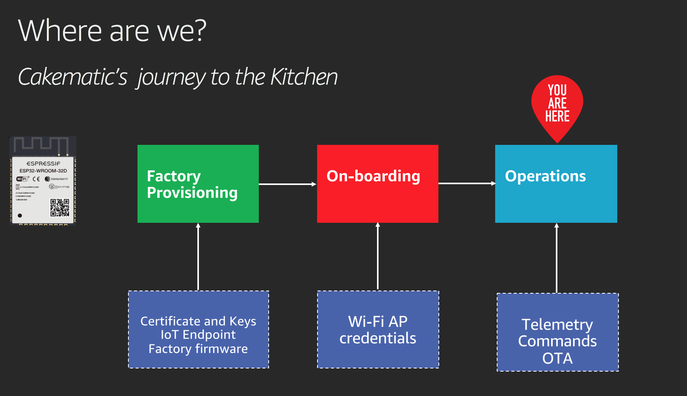
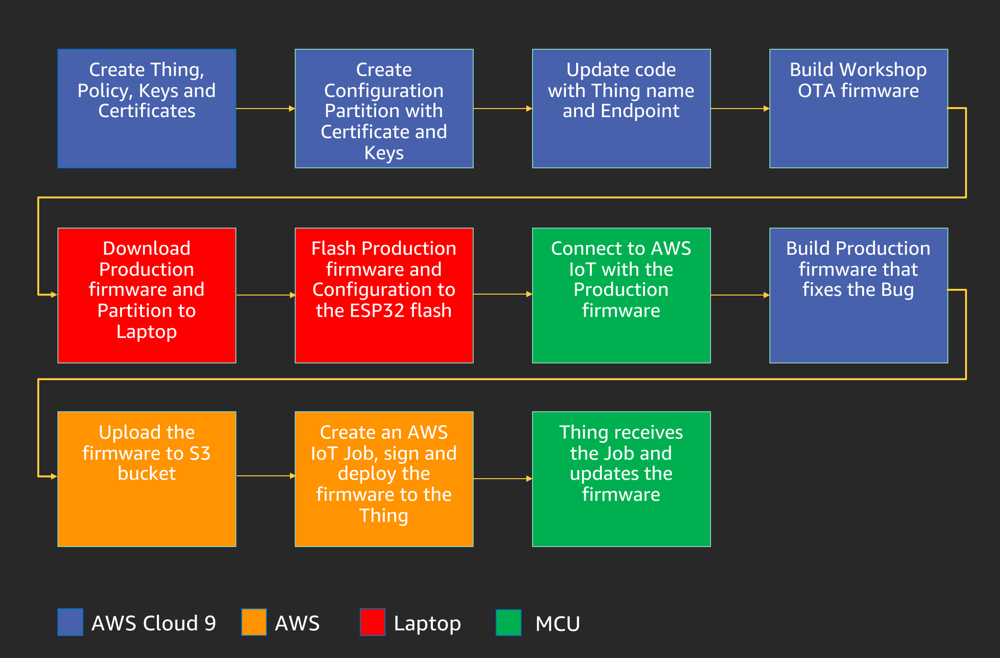

## Introduction

This repository was created to run the re:Invent 2019 Builder session on Amazon FreeRTOS (https://aws.amazon.com/freertos/).

## Pre-requisites

A laptop is required for this session. To be able to flash the firmware and configuration, the participants would need to have ESP-IDF installed on thier laptop. Instructions to do so will be provided in the documentation. The Firmware build will be done on Cloud 9 https://aws.amazon.com/cloud9/ and a fully configured build environment will be provided to participants.

## Where are we?

Cakematic is a modern oven which has state-of-the-art features for baking cakes. Cakematic is currently going through thier pilot and have sent out 1000+ appliances to customers across the US.

The Marketing team has received feedback from Customers that there is a bug with regards to the LED indicator when a Cake is fully baked, the User manual states it should light up the **GREEN** LED, but the **RED** LED is turning ON. The Firmware development team has come up with a new firmware that fixes this bug and this needs to be deployed to Cakematic. In this workshop you are going to learn about Cakematic's device lifecycle right from Factory based Provisioning to Connecting to AWS IoT cloud and finally deploying an OTA updated to Cakematic, Enjoy!.

# Workshop contents

The high-level workshop flow is shown below,

### 1. Workshop Setup
The workshop build environment is setup on a Cloud9 environment and will be provided to you by the instructor. ESP-IDF and the xtensa toolchain will be already setup. Login to your Cloud9 environment using the information provided by the instructor. Follow instructions for setting up the required software on the Laptop by clicking [here](docs/01_CLOUD_INIT.md).

### 2. AWS IoT Setup
In this step you will create the Certificates, Keys and code signing certificate required for Over-the-Air updates. Get started by [clicking here for Step 2](docs/02_AWS_IOT_SETUP.md).

### 3. Factory Provisioning
In this step we are going to create the required assets and production firmware to provision the ESP32 module.Get started by [clicking here for Step 3](docs/03_FIRMWARE_AND_PARTITION_BUILD.md)

### 4. OTA Setup
In this step we are going to are going to flash the firmware and configuration to the ESP32 module .Get started by [clicking here for Step 4](docs/04_OTA_SETUP.md)

### 5. OTA update
Finally, we are going to do an OTA update to fix a bug that was reported to the Marketing team. Get started by [clicking here for Step 5]()
