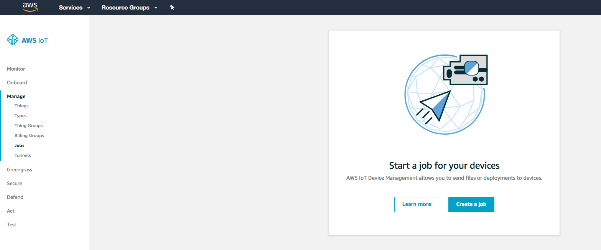
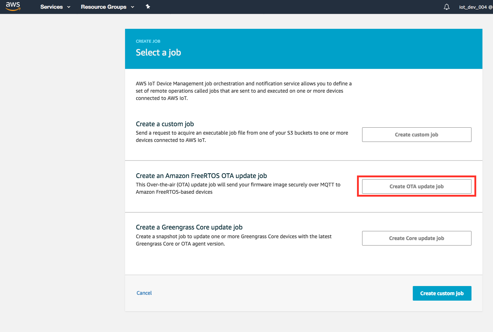

## OTA Update 

### Making code changes for to fix the Bug


## Code Change 1
We now need to make some code changes to get the GREEN light flashing instead of the RED light and build the firmware and deploy it to the Cakematic device. The changes need to be done in the **ota** directory of **demos** in the file **aws_iot_ota_demo.c**, 

The path to the file within amazon-freertos will be as shown below,

```
amazon-freertos/demos/ota
```


```
static void pBlinkOnCakeReady(void *pParam)
{
    uint32_t xGpioPin = GPIO_RED;

    vTaskDelay(10000 / portTICK_PERIOD_MS);
    gpio_pad_select_gpio(GPIO_RED);
    /* Set the GPIO as a push/pull output */
    gpio_set_direction(GPIO_RED, GPIO_MODE_OUTPUT);

    while (1)
    {
        /* Blink off (output low) */
        printf("Turning off the LED\n");
        gpio_set_level(xGpioPin, 0);
        vTaskDelay(500 / portTICK_PERIOD_MS);
        /* Blink on (output high) */
        printf("Turning on the LED\n");
        gpio_set_level(xGpioPin, 1);
        vTaskDelay(500 / portTICK_PERIOD_MS);
    }
}

```

We need to modify the line which sets the xGpioPin variable from GPIO_RED to GPIO_GREEN. Alternatively, if this was part of the configuration on what LED needs to blink on cake ready, this information could have been updated via an OTA Custom job in the NVS storage partition which we are using for storing certificate,keys and other configuration, but that is left as a exercise for participants.

Let us go ahead and make the code changes,

```
uint32_t xGpioPin = GPIO_GREEN;
```


## Code change 2

Amazon FreeRTOS compares the build version of the current running firmware to the one received via an OTA update. The build number should be higher than the firmware running on the MCU currently to update the firmware to the new version, hence we need to update the BUILD_VERSION_NUMBER as well.


Let us increment the version change from version 5 to version 6.

```
#define APP_VERSION_MAJOR 0
#define APP_VERSION_MINOR 9
#define APP_VERSION_BUILD 6
```

Let us run make command from the build directory to build a new binary file for the OTA update, from the **amazon-freertos/build** directory,

```
build$ make
```

You should now have the latest frmware ready to be deployed via AWS IoT Device Management. We will now go through the OTA workflow to deploy the firmware update to your thing. Before that we need to upload the firmware to the S3 bucket we created before. 

```
$aws s3 cp firmware.bin s3://<BUCKET_NAME>/furmware_v_1_1.bin
upload: ./firmware.bin to s3://<BUCKET_NAME>/firmware_v_1_1.bin 

```

## Deploying the update

We are now all set to deploy the update to the Cakematic device. Head to the AWS IoT Console and then select AWS IoT from the Services menu. Select **Manage** eand then **Jobs** from the Sidebar,




Choose **Create OTA update** job, OTA jobs are used for Firmware updates. **Create custom job** is used for sending commands or configuration to the devices. 




